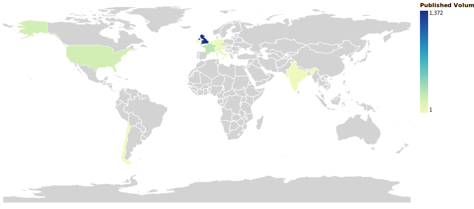
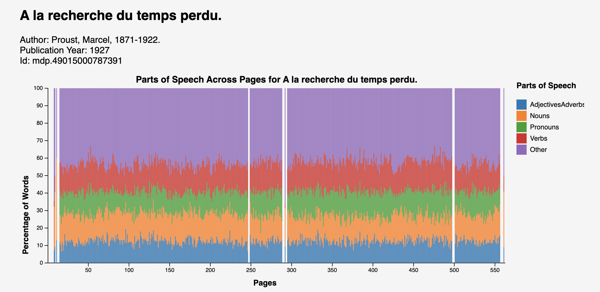

# Hackathon Creations
See the list below for some of the work created during the HTRC TORCHLITE Hackathon!

---

## Publication Info Notebook
Jupyter notebook for viewing and analyzing publication information with HTRC TORCHLITE data and APIs.

### publication-info.ipynb
Visualizes publication place on a choropleth map.

### pubDate.ipynb
Lists volumes (with title, publisher, and publication place) by publication date.

<https://github.com/htrc/torchlite-publication-info>

--- 

## Parts of Speech Across Pages in a Single Volume
In this project, we extract POS counts using the HTRC Extracted Features API and visualize the proportion of these tags on the page level across a volume. To gain a better understanding, we group the POS tags into larger categories and end up with 5 categories in total for each language: Verbs, Nouns, AdjectivesAdverbs, Pronouns, and Other. In addition, we accounted for the differences in POS tags for each different language, including Chinese, Spanish, German, French, and Arabic. Our hypothesis is that, for fiction, the beginning of the volume would have more nouns to introduce different agencies and objects. However, by comparing several volumes, we found that there is often no significant variation in the percentage of each category throughout a single volume. We also found that, unsurprisingly, non-fictions tend to have a larger percentage of nouns. Our project allows the user to input the HTID of their choice and compare different volumes. Overall, this project can be applied to gain insights into the variation of POS distribution across volumes and across languages.

<https://github.com/gworthey/TORCHLITE_PoS/>

---

## Noun word cloud

A proper and common noun wordcloud generator for the HathiTrust Research Center's TORCHLITE extracted features API.

<https://github.com/GrantLS/htrc-noun-wordcloud>

---
## Search a term across an HTRC workset

Many digital humanities scholars may be familiar with Bookworm+HTRC or the Google N-gram viewer. Both tools allow users to search for specific tokens (words) across a large text dataset and then graphs the results (words per million) in the form of a line graph. While these are great tools for visualizing the use of words on a large scale, some users may be interested in doing a similar analysis, using a select corpus.

<https://observablehq.com/@jswatsch/search-a-term-across-an-htrc-workset>

---
## CoWord

Preliminary notebook of CoWord co-occurece tool from HTRC Torchlite Hackathon

This notebook was created as part of the [HTRC TORCHLITE Hackathon](https://htrc.github.io/torchlite-hackathon/cfp.html). I was interested in exploring the co-occurrence of words within sets of texts and utilized the [Toni Morrison 10](https://analytics.dev.htrc.indiana.edu/publicworksets/43febde8-025f-49c9-aeec-7358ea788f3f) workset for testing this file.

For a given workset, you can supply a keyword. The notebook will lemmatize that keyword and generate a list of all of the (lemmatized) tokens that appear on the same page as that word within the volumnes contained in the workset. It will generate:

1.  A bar chart of the number of times the keyword appears in each of the volumes in the workset
2.  A wordcloud of the nouns that appear on the same page as that key word most frequently across the workset
3.  A table of the most words that co-occur most frequently alongside the keyword within each volume.

<https://github.com/bkrien/CoWord>

---

## Extracted Features Café (EFC)!

The EFC is a standalone web app (implemented in Flask) designed to make the HathiTrust Extracted Features API ([https://htrc.stoplight.io/docs/ef-api/8xpvh96ani2e0-ef-api](https://htrc.stoplight.io/docs/ef-api/8xpvh96ani2e0-ef-api)) accessible to nonprogrammers, and to expand accessibility by allowing users to search for the Extracted Features using common unique identifiers such as OCLC, ISSN, ISBN, LCCN, and HathiTrust record number.

By providing user-friendly tools and data visualizations, the EFC aims to bridge the gap between humanities students and computational resources. This will empower them to leverage digital libraries without needing extensive programming knowledge.

<https://github.com/lclarete/htrc-hackathon>

---
## Presidential Authorship

The HTRC Workset "[USA Presidential Papers](https://htrc.github.io/torchlite-handbook/worksets.html)" contains 779 volumes of "collections of the Papers of the US Presidents over time, Hoover to Obama."

These volumes are not always identified with the president's name. Thus, we have built a technique to predict the presidents based on the texts of the volumes.

The HTRC dataset only provides Extracted Features, which is essentially a list of words that appear on each page of each volume. We do not have the original text. Even so, we believe an LLM can examine a list of words and predict the president.

This code fetches each volume (and saves each to a file for caching), then generates a sliding window of 300 tokens over the text. For each 300 tokens, an LLM is asked to predict the president. We use the [guidance](https://github.com/guidance-ai/guidance) library to constrain the LLM's choices to names of presidents (Hoover to Obama). Since the prediction may be somewhat random depending on the quality of the window of text, we run 30 predictions over different regions of text and take the most common prediction (a voting technique). The model's predictions (votes) are also recorded in the output file.

On a 4090 GPU, the code seems to take about 4.5 hours to run through all volumes.

<https://github.com/joshuaeckroth/htrc-presidential-authorship>

---

## HTRC Hackathon Presidents

We were interested in identifying the most distinctive terms associated with the papers of different presidents, defining “distinctiveness” as term frequency x inverse document frequency. Our theory is that looking for distinctive terms can help identify new issues covered in the papers that may have been a significant focus of a president but would not otherwise surface looking exclusively at term frequency. These issues could then be the start of new historical inquiries using traditional methods.

Our code visualizes the most distinctive terms by volume in a wordcloud but also produces CSVs containing individual TF_IDF scores for more granular analysis. It unfortunately took a long time to run, so we made a couple sacrifices: Rather than work with the full workset of more than 650 volumes of presidential papers, we chose a subset of six from different administrations. Additionally, we had to limit TF_IDF calculations to 10,000 terms per volume. However, we hope to continue working on this project in the future and eventually be able to expand our analysis.

While we were working specifically with presidential papers, we also tested our code with the Toni Morrison dataset and produced what appear to be meaningful results.

<https://github.com/igwink/HTRC_Hackathon_Presidents>

---

## HathiTrust-MARC-monitoring
The primary goals of this hackathon project are 1) to develop Python code for monitoring updates to MARC records in HathiTrust, and 2) to build an exploratory notebook to enable quick monitoring of this.

<https://github.com/bcglee/HathiTrust-MARC-monitoring>


