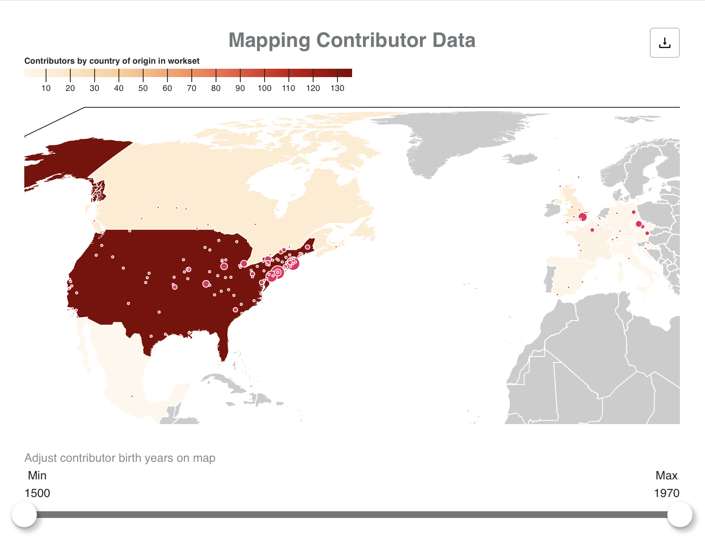
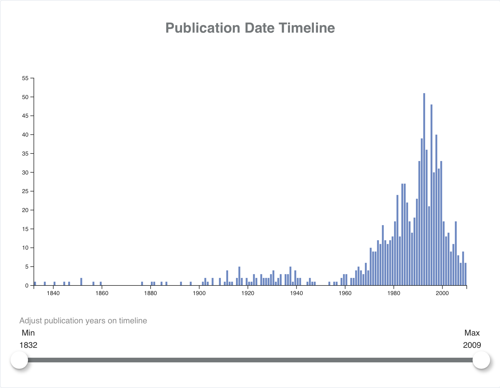
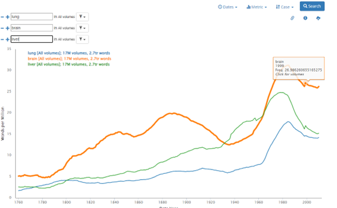
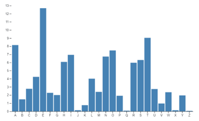
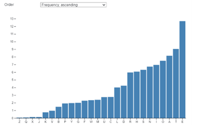
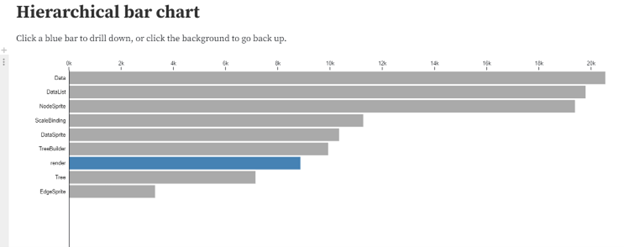
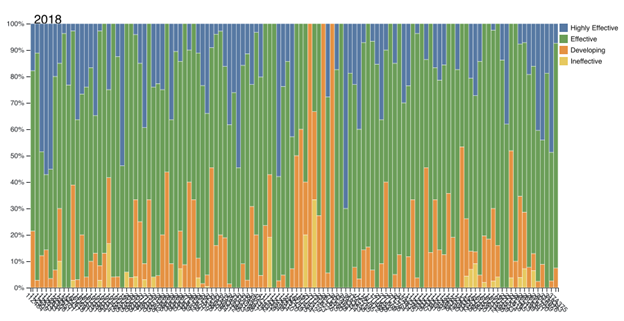



We are excited to see what ideas attendees have for potential projects to work on during the hackathon. While we hope to encourage and cultivate participants' own creative projects, we also recognize that first time hackers may be overwhelmed when it comes time to finding a project to work on. For that reason, we've clearly articulated a few potential projects, which HTRC staff will lead and participants can join.


# Publication Place Map
## Use case
Undergrad students in a digital humanities are studying a bibliographic dataset derived from known items in the personal library of Victorian poetry Algernon Charles Swinburne. They are asked to analyze various attributes of the books, such as language, publication dates, genre, etc. For this task it will be useful to display places of publication on a date and the number of volumes from published in each place.

| Title                   | Publication Place Map |
| ----------------------------------       | ---  |
| **visualization type**                       |  map |
| **description**                          |  This widget will visualize the place of publication for all volumes in a workset on a map of the world, zoomed in to the area(s) of coverage.      |
| **Relevant extracted features field(s)** | `pubPlace`, `publisher`|

## Description
This proposed tool is basically a version of the existing “Mapping Contributor Data” widget, but uses place of publication data rather than creators’ birthplace data. Like the “Mapping Contributor Data,” parameters may allow a user to filter the displayed results by publication date (or other parameters). The size of the location indicators should increase to correspond with the number of volumes published in a particular location, e.g., London.




<figcaption style="">Mapping Contributor Data</figcaption>

Possible enhancement could include combining the Publication Place Map with a version of the existing “Publication Date Timeline“ or adding useful contextual data to the downloadable CSV data. For example, for each row of data, one might include columns containing arrays of `htid` and `title` values for the volumes published in a particular place.  



<figcaption style="">Publication Date Timeline</figcaption>

## Extracted Features data points necessary
```
metadata
  htid
  title
  pubPlace
  pubDat
  publisher
```

## Tasks
- Write API call to grab metadata
- Write API call to get token data
- Code or edit code for a map on which locations may be plotted
- Code or edit code to limit plotted locations by range of publication dates
- Optionally: Integrate a publication date timeline and/or publisher data for a more comprensive “pubication data” analysis tool.

# Searching and visualizing specific words in a workset 
## Use case
A professor is interested in studying how terminology for human bodies, body systems, biology, and other living systems have been used to describe architecture and buildings. From close reading, we know that mentions and comparisons of architecture/buildings to human bodies, organs or other living systems can be noticed beginning in the earliest work in the Western tradition, Vitruvius’ De Architectura, in which he “puts forth a vision of architecture understood as an appreciation of the human body as its regulating system, based on the “optimal proportions of the human body”. It would be useful to be able to compare the usage of these words over time using a workset comprising volumes specifically about architecture and design.

| Title                   | Publication Place Map |
| ----------------------------------       | ---  |
| **visualization type**                       |  bar chart, line chart |
| **description**                          |  This visualization will plot the use of specific words within a workset, over time.      |
| **Relevant extracted features field(s)** | `title`, `datePublished`, `tokenPosCount`|

## Description
Like Bookworm, the visualization would graph the use of particular words over time, but would be restricted to a workset. Since a workset is much smaller than the overall HT corpus, the scale would be smaller than bookworm. Instead of words per million, it could be words per thousand or perhaps just a straight count of the words.



<figcaption style="">Bookworm</figcaption>


There is also an opportunity to provide other dynamic features that allow you to examine a particular work or alternative ways of displaying the data. For example, an alternative way to view the data could be a bar chart instead of a line graph. A bar chart would allow you to order the chart by time, and ascending, or descending.





Another possible dynamic element could allow you to click on a bar and see a different view of an individual year. It would show the volumes from that year and how often that term appears in a specific volume. The hierarchical bar chart on Observable is an example of a bar chart that lets you drill down into a specific category: [Hierarchical bar chart / D3 \| Observable](https://observablehq.com/@d3/hierarchical-bar-chart?intent=fork)


<figcaption style="">Hierarchical bar chart</figcaption>

## Extracted Features data points necessary
```
metadata
  title
  datePublished
features
  pages
    body
      tokenPosCount
```

## Tasks
- Write API call to grab metadata
- Write API call to get token data
- Write function to iterate through token data
- Code a search bar feature
- Code or edit code for hierarchical bar chart
- Code any additional interactive features

# Comparing the relative proportions of parts of speech across a single volume
## Use case 
A researcher wants to understand and demonstrate whether the beginning of a novel – often assumed to be more descriptive than narrative – is characterized by a greater proportion of adjectives than verbs than the middle or the end.
Description

One possible way to investigate this question is to calculate and compare the number of particular parts of speech (or categories of parts of speech – e.g., adjectives of all types, as compared with nouns and pronouns) on a particular page.  These could be represented as percentages of the total number of words on that page, and graphed as a percent stacked bar chart.  Here’s an example of this sort of chart, written in .d3:


<figcaption style="">https://observablehq.com/@xianwu/stacked-bar-chart</figcaption>

In our case, the y-axis could be stacked bars adding up to 100%, and the x-axis could be pages (or aggregated page ranges, e.g., a single bar could represent a certain number of pages, or a certain percentage of the whole volume).

## Extracted Features and other data required
```
features
	pages
		seq
body
	tokenPosCount

Part-of-speech tags as described by the Penn Tree Bank – e.g., JJ, JJR, and JJS are all types of adjectives.
```

## Tasks
- Write API call to get token data from a single volume
- Write function to get the page sequence
- Write function to add the occurrences of each desired part-of-speech bit of the token data for a each page
- Write function aggregating these sums into the desired number of pages
- Write function (or hard-code) mapping the part-of-speech tag to desired category (e.g., all adjectives)
- Code an appropriate bar plot to visualize the aggregated counts for each grammatical category, across each page range of the desired size.

